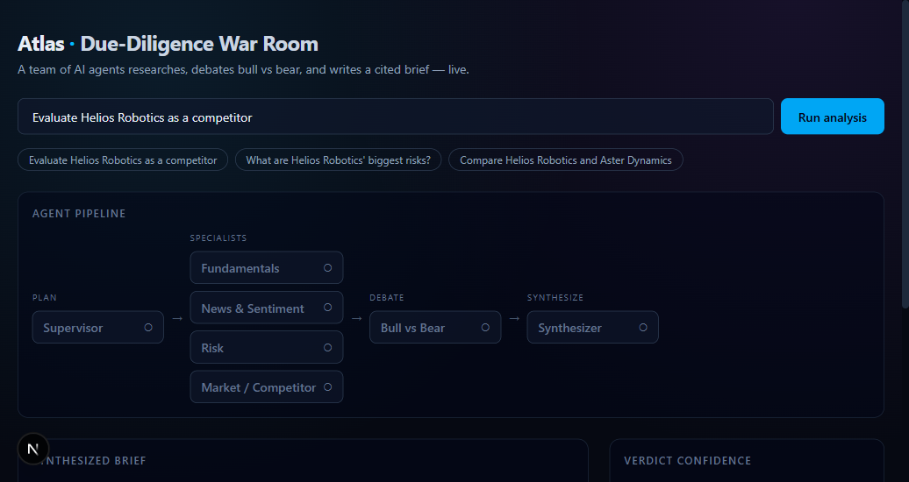
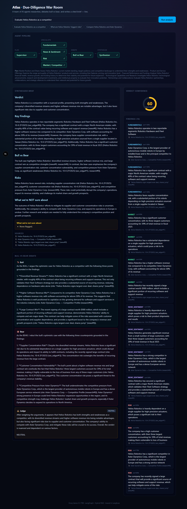

<div align="center">

# 🛰️ Atlas — Autonomous Due-Diligence Desk

**A team of specialist AI agents that research a company, _debate each other (bull vs. bear)_, ground every claim in retrieved evidence, and deliver an investor-grade report — with citations, a confidence score, and an honest "what we're NOT sure about" section.**

[](https://www.python.org/)
[](https://langchain-ai.github.io/langgraph/)
[](https://console.groq.com/)
[](https://fastapi.tiangolo.com/)
[](https://nextjs.org/)
[](https://qdrant.tech/)
[](https://langfuse.com/)
[](https://www.docker.com/)
[](#-testing)

_Real multi-agent orchestration · agentic hybrid RAG · MCP tools · end-to-end observability · a self-improving LLM-Ops loop._

</div>

---

## 🎯 What it does

Ask Atlas a question like _"Should I worry about Company X as a competitor?"_ and instead of a single, unverifiable LLM answer, Atlas runs a **whole desk of AI analysts**:

1. A **supervisor** dispatches four specialists — **Fundamentals · News/Sentiment · Risk · Market** — that research **in parallel**.
2. Their findings go into a **Bull ⇄ Bear debate**, where one agent argues the upside and one argues the downside.
3. A **Synthesizer + Judge** merges both sides into a **cited report** with a **confidence score** and an explicit list of what the system is _not_ sure about.
4. A **grounding guardrail** rejects any claim that isn't backed by retrieved evidence — so the report can't hallucinate silently.

## ✨ Why this project stands out

| | |
|---|---|
| 🧠 **True multi-agent orchestration** | Not a prompt chain — a real **LangGraph** graph with a supervisor, parallel specialists, a debate loop, and shared **SQLite-checkpointed** state that can resume after a crash. |
| 🔍 **Agentic hybrid RAG** | **BM25 + bge dense** embeddings fused with **RRF**, a **cross-encoder re-ranker**, and a **CRAG** self-correction loop that re-searches when evidence is weak. |
| 🌐 **Hybrid evidence** | CRAG's three-way grade decides the source: curated documents when they answer, **documents + live web combined** when partial, web alone when they don't. Web hits become the same citable chunk type, so provenance works identically either way. |
| 🛠️ **MCP tool server** | Agents pull live evidence via **web search (Tavily) · SEC EDGAR · stock data · company news** — each tool degrades gracefully on failure. |
| 🗂️ **Four memory layers** | **Working** (graph state) · **Semantic** (RAG) · **Episodic** (SQLite + vectors of past runs) · **Procedural** (playbooks) — plus a **Summarizer agent** that distills old runs into durable facts. |
| 📈 **Self-improving LLM-Ops** | Every run is auto-evaluated with **Ragas** → gated → weak prompts are **diagnosed, rewritten, re-evaluated, and released** through a versioned prompt registry. |
| 🎯 **Per-agent evaluation** | Each specialist is scored **individually** (groundedness + richness) and charted in Langfuse — so a weak run is attributed to a *specific* agent, not just the final report. |
| 📥 **Teachable at runtime** | Upload a document, paste text, or pull a **real SEC filing by ticker** from the UI — it's chunked, embedded, and searchable by the very next run. Ingestion is idempotent. |
| 📄 **Export the brief** | One click renders the run as a clean, paper-formatted **PDF** — verdict, findings with sources, debate, and known unknowns. |
| 👁️ **Observability-first** | Every agent node and tool call is traced in **Langfuse** with token + cost; Ragas scores pushed as dashboards. |
| 🧪 **Fully offline test suite** | CI-friendly, hermetic tests run with zero API keys or network — stub LLM + hashing embedder. |
| 💸 **$0 to run** | Groq free tier + local embeddings + self-hosted Qdrant & Langfuse. Clone and run for nothing. |

## 🖥️ Screenshots

<div align="center">

**Live war-room — agents researching & debating in real time**



**Final cited report with confidence score**



</div>

## 🏗️ Architecture

```
Next.js war-room UI ──SSE──> FastAPI ──> LangGraph graph  (SQLite-checkpointed state)

   recall(memory) → SUPERVISOR → [ Fundamentals · News/Sentiment · Risk · Market ]  (parallel)
                       → BULL ⇄ BEAR debate → SYNTHESIZER + JUDGE
                       → remember(memory) → cited report + confidence

  Memory        Working (state) · Semantic (RAG) · Episodic (SQLite+vectors) · Procedural (playbooks)
                + Summarizer agent (cheaper model) distilling past runs into durable facts
  Hybrid RAG    BM25 + bge (EnsembleRetriever/RRF) → CrossEncoderReranker → CRAG → Qdrant/InMemory
  Tools (MCP)   web_search (Tavily) · sec_edgar · stock_data (stooq) · company_news
  LLM-Ops       Langfuse trace + Ragas eval → gate → diagnose → rewrite prompt → re-eval → release
```

## 🤖 Meet the agents

Atlas is a **team**, not a prompt chain. Each agent has a single job, its own procedural playbook, and evidence-grounded output:

| Agent | Role |
|---|---|
| 🧭 **Supervisor** | Plans the run and dispatches the four specialists in parallel over shared state. |
| 📊 **Fundamentals** | Digs into financials, filings, and business model — the numbers behind the company. |
| 📰 **News / Sentiment** | Reads recent news and gauges momentum, tone, and market perception. |
| ⚠️ **Risk** | Hunts for red flags — competition, regulation, concentration, execution risk. |
| 🏹 **Market** | Sizes the market and maps competitive positioning. |
| 🐂 **Bull** vs 🐻 **Bear** | Debate the evidence — one argues the upside, one argues the downside. |
| ⚖️ **Synthesizer + Judge** | Weighs both sides into a **cited report** with a **confidence score** and a "what we're not sure about" section. |
| 📝 **Summarizer** | Runs on a cheaper model to distill past runs (episodic memory) into durable semantic facts. |

Every agent node attaches Langfuse callbacks, so the whole run shows up as a **traceable, costed span tree**.

## 🔍 Agentic hybrid RAG pipeline

Retrieval is designed so nothing gets missed and nothing weak slips through:

```
query
  ├─▶ BM25Retriever            (exact keywords, tickers, names)
  └─▶ bge-small dense vectors  (semantic meaning)
        │
        ▼
   EnsembleRetriever (RRF)     fuse both rankings
        ▼
   CrossEncoderReranker        re-score top candidates for true relevance
        ▼
   CRAG grade ── weak? ──▶ rewrite query + re-search (self-correction)
        │ strong
        ▼
   grounded evidence (with provenance) → agents
```

- **Hybrid** because pure semantic search misses exact terms (tickers, product names) and pure keyword search misses meaning — you need both.
- **CRAG** means the system doesn't blindly trust its first retrieval: it grades the context and re-searches when it's weak.
- **Provenance everywhere** — every chunk carries its source so the grounding guardrail can enforce citations.

## 🔁 The self-improving LLM-Ops loop

This is the part that turns Atlas from "a demo" into "a system that measures and improves itself":

```
run research ─▶ evaluate (Ragas) ─▶ gate ──pass──▶ ✅ release
                  │  faithfulness       │
                  │  answer relevancy   └──fail──▶ diagnose weak prompt
                  │  context precision                  │
                  └──────────── push scores ──▶ Langfuse │
                                                         ▼
                                          rewrite prompt (candidate)
                                                         ▼
                                          re-evaluate ─▶ gate ─▶ release
                                                                (versioned prompt registry)
```

- **Auto-eval** — every run is scored on faithfulness, answer relevancy, and context precision.
- **Quality gate** — runs below threshold don't ship; they trigger improvement.
- **Self-improvement** — the optimizer diagnoses the failing prompt, rewrites it, re-evaluates, and only promotes it if it actually scores better.
- **Versioned prompt registry** — active prompt + candidate canary + full history, so every change is tracked and reversible.

## 🧰 Tech stack

| Layer | Choice |
|---|---|
| **Orchestration** | LangGraph (supervisor + specialist nodes, SQLite checkpointer) |
| **LLM** | Groq · Llama 3.3 70B (`llama-3.3-70b-versatile`); 8B (`llama-3.1-8b-instant`) for cheap ops tasks |
| **RAG** | LangChain hybrid: `BM25Retriever` + `bge-small-en-v1.5` (EnsembleRetriever/RRF) → `CrossEncoderReranker` → CRAG · Qdrant/InMemory |
| **Embeddings** | `BAAI/bge-small-en-v1.5` — free, local (sentence-transformers) |
| **Memory** | Episodic (SQLite + embeddings) · Procedural (playbook files) · Summarizer agent |
| **Tools** | MCP server: web_search (Tavily) · sec_edgar · stock_data (stooq) · company_news |
| **Backend** | FastAPI + SSE streaming |
| **Observability** | Langfuse (trace/eval/cost) + Ragas + self-improving LLM-Ops loop |
| **Frontend** | Next.js + Tailwind (hand-rolled war-room components) |
| **Infra** | Docker Compose (qdrant + langfuse + api + web) |

## 🚀 Quickstart (local)

```bash
# 1. Configure — only GROQ_API_KEY is required (free key: https://console.groq.com/keys)
cp apps/api/.env.example apps/api/.env

# 2. Bring up infra (Qdrant + self-hosted Langfuse)
docker compose up -d qdrant langfuse

# 3. Run the API
cd apps/api
pip install -e ".[dev]"
uvicorn atlas.main:app --reload      # → http://localhost:8000  (docs at /docs)

# 4. Sanity check
curl http://localhost:8000/health
curl http://localhost:8000/health/ready    # shows which integrations are wired
```

Run the **war-room frontend**:

```bash
cd apps/web && npm install && npm run dev  # → http://localhost:3000
```

Or run the **whole stack** in containers:

```bash
cp apps/api/.env.example apps/api/.env
docker compose up                          # qdrant + langfuse + api + web
```

## 🔌 API endpoints

| Method | Path | Purpose |
|---|---|---|
| `GET` | `/health`, `/health/ready` | liveness + per-integration readiness |
| `POST` | `/research/sync` | run the multi-agent pipeline, return the cited report |
| `GET` | `/research/stream?q=...` | SSE stream of per-agent events (drives the war-room UI) |
| `GET` | `/corpus/status` | what's indexed — documents + chunk count |
| `POST` | `/corpus/upload` | ingest an uploaded `.md`/`.txt` file into the live index |
| `POST` | `/corpus/text` | ingest pasted text |
| `POST` | `/corpus/sec` | fetch a real SEC filing by ticker and ingest it |
| `GET` | `/llmops/prompts` | list versioned synthesizer prompts (active + history) |
| `POST` | `/llmops/optimize` | run the self-improvement loop (eval → gate → rewrite → release) |

## 🗂️ Project layout

```
apps/api/atlas/
  core/graph.py        LangGraph wiring (recall → supervisor → specialists → debate → synthesize → remember)
  core/agents/         specialists (4), debate (bull/bear/judge), synthesizer, base
  core/rag/            LangChain hybrid retrieval + CRAG, ingestion, embeddings
  core/memory/         episodic (SQLite+vectors), procedural (playbooks), summarizer
  core/llmops/         prompt registry, auto-eval, per-agent eval, gate, self-improvement optimizer
  core/tools/          web_search (Tavily), sec, market (stock + news)
  eval/                golden set, retrieval eval, Ragas → Langfuse scores
  routers/             health, research (SSE), llmops
apps/web/              Next.js war-room frontend
data/corpus/           sample corpus (*.md tracked); other ingested docs gitignored
data/playbooks/        procedural-memory agent playbooks
docs/                  architecture + deployment runbook
.claude/               project subagents + skills that drove development
CLAUDE.md              architecture, stack, conventions, milestones
```

## 🧪 Testing

The suite is **fully offline and hermetic** — a `conftest.py` forces `ATLAS_OFFLINE_LLM` and `ATLAS_OFFLINE_EMBED`, so **no API keys or network are needed** (CI-friendly):

```bash
cd apps/api && python -m pytest -q          # stub LLM + hashing embedder
```

Tests are **contract-focused** across unit / integration / API / eval layers, with an adversarial edge-case sweep (empty inputs, no-match queries, unicode, duplicate ingest, missing keys) and regression guards for every fixed bug.

## 🗺️ Roadmap

- [x] **M0** Dev harness — CLAUDE.md, subagents, skills
- [x] **M1** Skeleton & rails — FastAPI, Groq client, Langfuse, config, Docker, CI
- [x] **M2** Hybrid RAG core — EnsembleRetriever + CrossEncoderReranker + CRAG, Ragas
- [x] **M3** Agents & orchestration — supervisor graph, 4 specialists (parallel), shared state, tools
- [x] **M4** Debate & synthesis — bull/bear/judge, cited report + confidence + grounding guardrail
- [x] **M5** War-room frontend — live agent graph, streaming debate, report view
- [x] **M6** Memory layers — episodic (SQLite + vectors), procedural (playbooks), summarizer agent
- [x] **M7** LLM-Ops — auto eval → gate → self-improvement (rewrite prompt) → release (prompt registry)

## 📝 Design notes

- **Graceful degradation** — the API boots without Groq / Langfuse / Qdrant configured, and `/health/ready` reports exactly what's wired.
- **Free / self-hostable everywhere** — Groq free tier, local bge embeddings, SEC EDGAR + Tavily free tiers, self-hosted Langfuse + Qdrant. Note: Groq's free tier caps tokens/minute, so the multi-run self-improvement loop may be rate-limited without a higher tier.
- **Grounding is non-negotiable** — no report claim exists without a retrieved-evidence citation; the guardrail enforces it.

---

<div align="center">

Built by **Hari Krishna T** · [LinkedIn](https://www.linkedin.com/in/hari-krishna-thota-06b850275) · [GitHub](https://github.com/hari9618)

_Atlas is a portfolio project demonstrating senior-grade agentic engineering._

</div>
